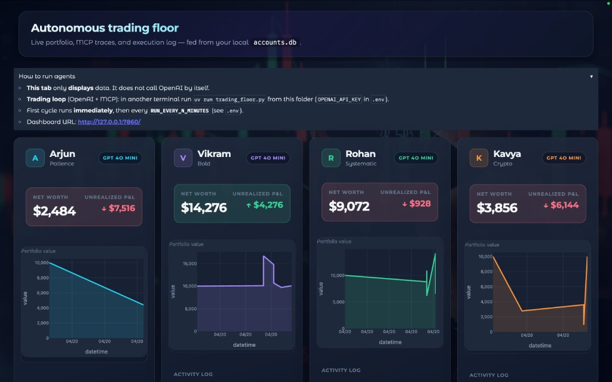
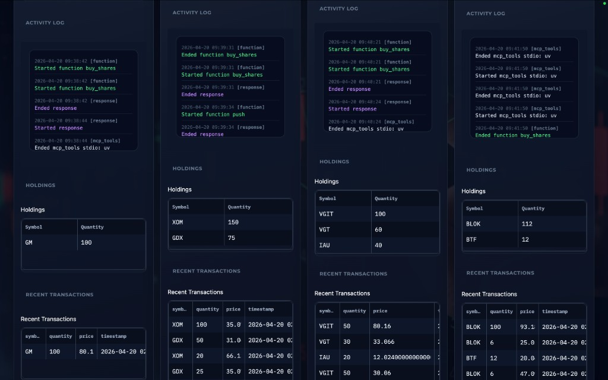

# mcp-trading

**Multi-agent paper trading** built with the [OpenAI Agents SDK](https://github.com/openai/openai-agents-python), [Model Context Protocol (MCP)](https://modelcontextprotocol.io) over **stdio**, and a **Gradio** dashboard. Four LLM-driven traders each run a distinct strategy, call MCP tools to research, price symbols, and execute simulated trades, and persist state in **SQLite** for observability in the UI.

> **Not production trading** — this is a simulation and tooling demo. Prices may come from Polygon or a random fallback; P&L is illustrative.

---

## Screenshots

**Dashboard overview** — full trading floor with per-agent net worth, unrealized P&L, portfolio time series (Plotly), and the hero banner noting data is read from `accounts.db`. The UI does not call the LLM; it reflects whatever `trading_floor.py` has already written.



**Detail** — per-agent **activity log** (trace/span style events: MCP, function tool calls, responses) plus **holdings** and **recent transactions** so you can correlate tool use with portfolio changes.



---

## What this project does

| Layer | Role |
|--------|------|
| **Trading loop** (`trading_floor.py`) | Async scheduler: runs up to four `Trader` agents on a fixed interval, **sequentially** (reduces concurrent `uv` / `npx` / MCP handshakes). Respects `RUN_EVERY_N_MINUTES`, optional “market open” gating via Polygon, and `RUN_EVEN_WHEN_MARKET_IS_CLOSED`. |
| **Agent layer** (`traders.py`) | Each trader is an `openai-agents` `Agent` with MCP servers attached: **accounts**, **push**, and **market**, plus a nested **Researcher** agent exposed as a **tool** (`Researcher`). The run toggles between “seek opportunities” and “rebalance” prompts. |
| **MCP stdio servers** | Python **FastMCP** servers for portfolio execution and a local or Polygon-backed market; optional Node `npx` servers for **fetch**, **Brave Search** (if `BRAVE_API_KEY` is set), and **LibSQL** memory per trader. |
| **State** (`accounts.py`, `database.py`) | `Account` is a Pydantic model with cash, holdings, transactions, strategy text, and a portfolio value time series, serialized to **`accounts.db`**. A **`logs` table** stores user-facing “activity” lines (accounts + custom trace processor). |
| **Dashboard** (`app.py`, `util.py`) | **Gradio** + **Plotly** + **pandas**: read-only view of the same database, with timers to refresh equity/holdings/transactions and stream logs. Optional full-page `landing-img.webp` background. |

The dashboard binds to **http://127.0.0.1:7860** by design (`server_name=127.0.0.1`).

---

## Technical architecture

**Process model** — you normally run **two** processes from the project root:

1. `uv run app.py` — HTTP UI (charts, tables, HTML logs).
2. `uv run trading_floor.py` — spawns MCP subprocesses, runs the LLM, updates `accounts.db`.

The UI never invokes OpenAI; it only displays persisted state. Until the loop has run at least once, accounts stay near the default cash balance and charts are flat (or a single “current” point).

**MCP layout** (see `mcp_params.py`):

- **Trader servers**: `uv run accounts_server.py`, `uv run push_server.py`, and market data either `uv run market_server.py` (EOD / local pricing path) or **`uvx`** the Polygon MCP when `POLYGON_PLAN` is `paid` or `realtime`.
- **Researcher servers** (per run, per trader name):
  - `mcp-server-fetch` via `uvx` for page retrieval.
  - `npx @modelcontextprotocol/server-brave-search` **only if** `BRAVE_API_KEY` is set (omitted otherwise so startup cannot fail on empty env).
  - `npx mcp-memory-libsql` with `file:./memory/{name}.db` for per-trader memory.

`StdioServerParameters` use a **120s** client session timeout; npm noise is reduced with `NPM_CONFIG_LOGLEVEL=silent` and `NPM_CONFIG_UPDATE_NOTIFIER=false`.

**Models** — by default all four agents use **`gpt-4o-mini`**. Set `USE_MANY_MODELS=true` to use the multi-model list in `trading_floor.py` (requires the matching provider API keys; optional clients in `traders.py` are created only when keys exist).

**Tracing** — `LogTracer` (`tracers.py`) is registered with `add_trace_processor` to mirror trace/span lifecycle into `logs` with types such as `trace`, `function`, and `response`, which the dashboard colors by event kind.

**Market and pricing** (`market.py`) — if `POLYGON_API_KEY` is set, the app uses the Polygon **REST** client: grouped daily (EOD) for the default plan, with optional caching in SQLite `market`; paid/realtime paths use snapshot or minute data. If Polygon is missing or errors, **`get_share_price` falls back to a random float** in a fixed range so local runs still trade. `is_market_open()` returns **true** when the key is absent or Polygon is unreachable, so scheduling is not blocked in dev.

**Account simulation** — initial cash **$10,000** per name; buys/sells apply a **0.2% spread**; `report()` appends to `portfolio_value_time_series` for charting.

---

## Repository map (core files)

| File | Purpose |
|------|---------|
| `trading_floor.py` | Scheduler, trader list (names, styles, models), `asyncio` loop. |
| `traders.py` | `Trader`, MCP `AsyncExitStack`, `Runner.run`, `MAX_TURNS`. |
| `mcp_params.py` | Stdio commands and env for all MCP processes. |
| `accounts.py` / `database.py` | Domain model + SQLite persistence. |
| `accounts_server.py` / `push_server.py` / `market_server.py` | FastMCP stdio tool servers. |
| `accounts_client.py` | Direct MCP stdio client for resource reads (strategy/account JSON for prompts). |
| `templates.py` | Researcher + trader system prompts and cycle messages. |
| `tracers.py` | Trace ID helper + `LogTracer` → `logs` table. |
| `app.py` | Gradio layout, Plotly figures, background CSS. |
| `util.py` | Shared CSS, JS hooks, color tokens. |
| `reset.py` | Reset all four named accounts to curated strategy strings. |

---

## Setup

1. Install [Python 3.12](https://www.python.org/) and [uv](https://docs.astral.sh/uv/).
2. Clone the repo and sync dependencies:

```bash
cd mcp-trading
uv sync
```

3. Copy `.env.example` to `.env` and set **`OPENAI_API_KEY`**.

## Environment variables

| Variable | Purpose |
|----------|---------|
| `OPENAI_API_KEY` | **Required** for the trader and nested researcher models (default OpenAI stack). |
| `POLYGON_API_KEY` | Optional. Real (or EOD) equity prices; omitted → random per-symbol prices. |
| `POLYGON_PLAN` | `paid` or `realtime` for alternative Polygon + MCP market wiring; leave empty for EOD + local `market_server.py` path. |
| `BRAVE_API_KEY` | Optional. If unset, the Brave Search MCP is not started. |
| `PUSHOVER_USER`, `PUSHOVER_TOKEN` | Optional. Pushover notifications from `push_server.py`. |
| `DEEPSEEK_API_KEY`, `GROK_API_KEY`, `GOOGLE_API_KEY`, `OPENROUTER_API_KEY` | Only when routing models to those providers in `trading_floor.py` / `get_model()`. |

**Scheduler and behavior**

| Variable | Default |
|----------|---------|
| `RUN_EVERY_N_MINUTES` | `60` (use `3` for quick local tests) |
| `RUN_EVEN_WHEN_MARKET_IS_CLOSED` | `true` (set `false` to skip when US equities are closed and Polygon reports closed) |
| `USE_MANY_MODELS` | `false` |

Researcher sidecars require **Node** for `npx` (fetch / optional Brave / LibSQL memory). Python pieces use `uv` / `uvx` as defined in `mcp_params.py`.

## Run

**Terminal 1 — dashboard (read-only)**

```bash
uv run app.py
```

Open **http://127.0.0.1:7860/**

**Terminal 2 — trading loop (LLM + MCP)**

```bash
uv run trading_floor.py
```

**Reset** strategies and notional accounts:

```bash
uv run reset.py
```

Local artifacts: **`accounts.db`**, **`memory/*.db`**, and **`.env`** are git-ignored; recreate from `.env.example` on a new machine.

---

## License

MIT — see [LICENSE](LICENSE).
